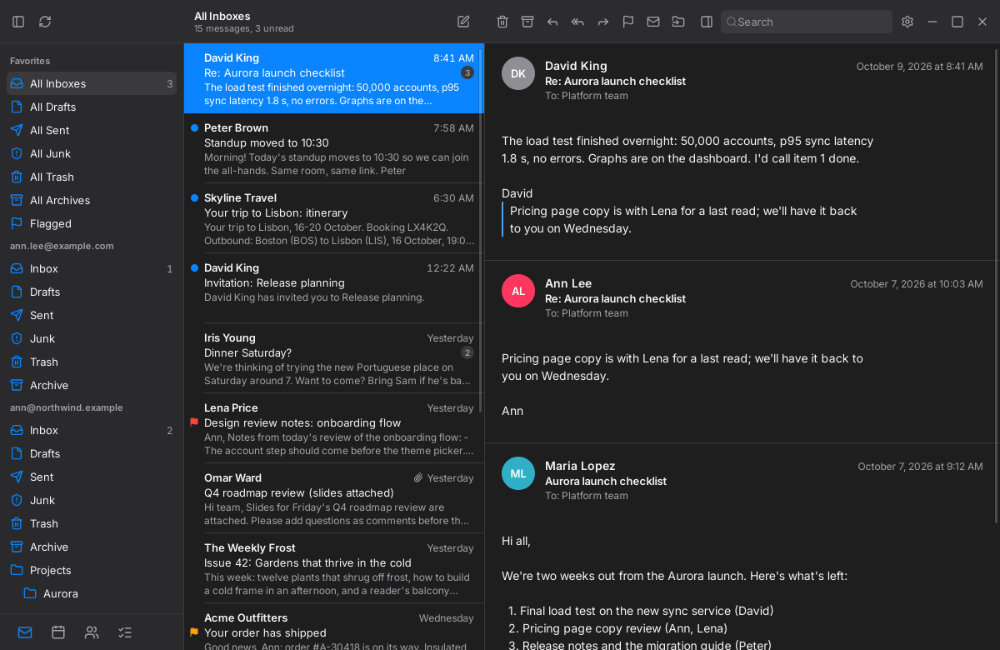
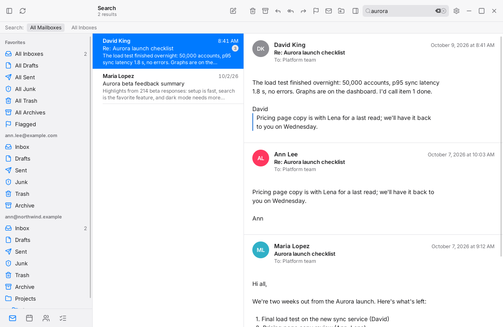
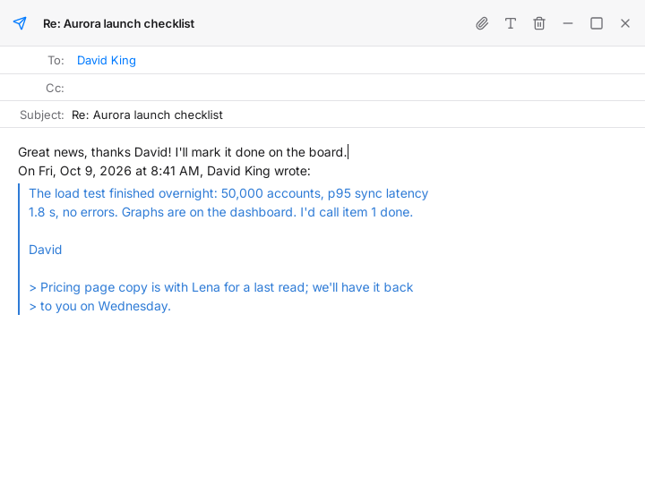
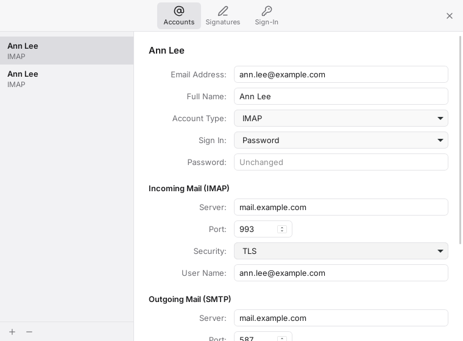
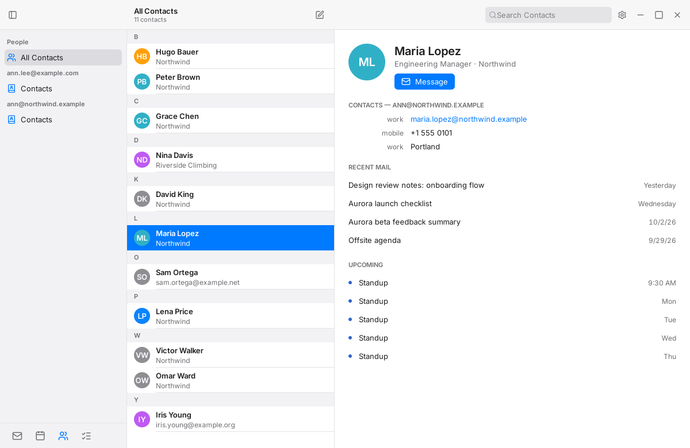
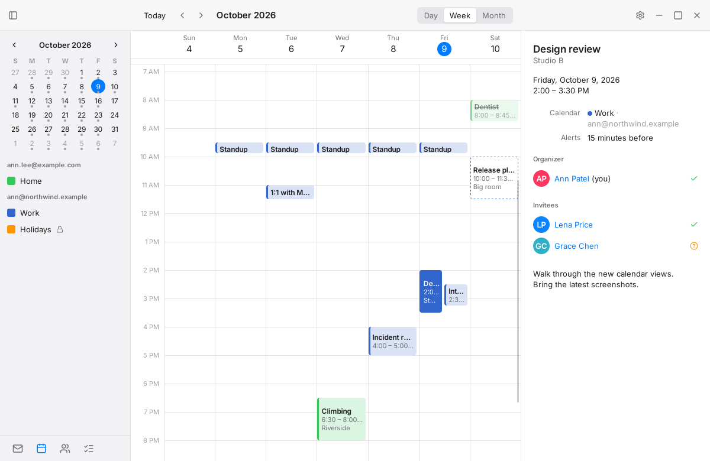
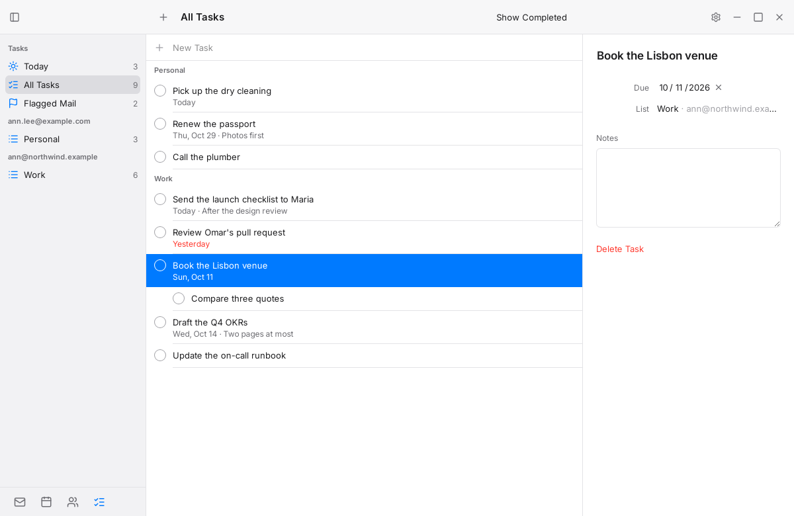
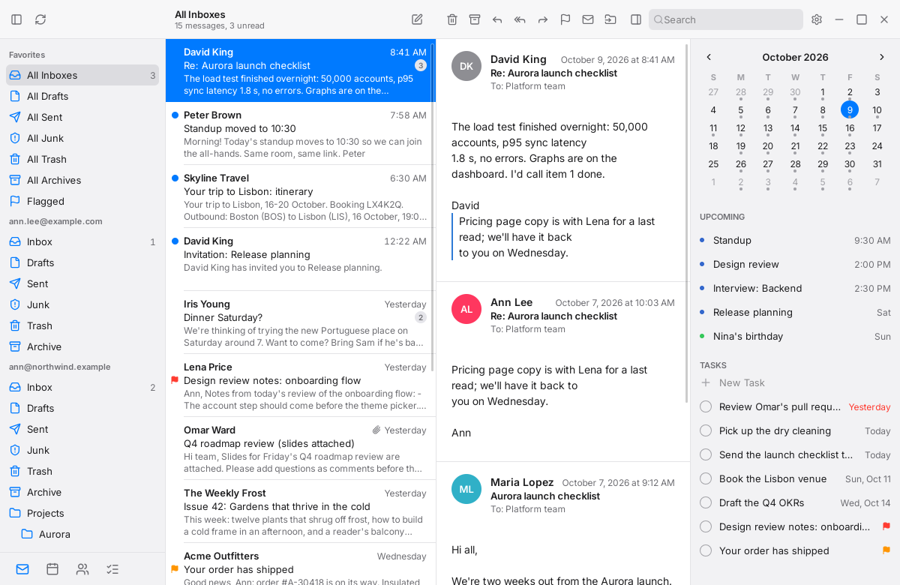
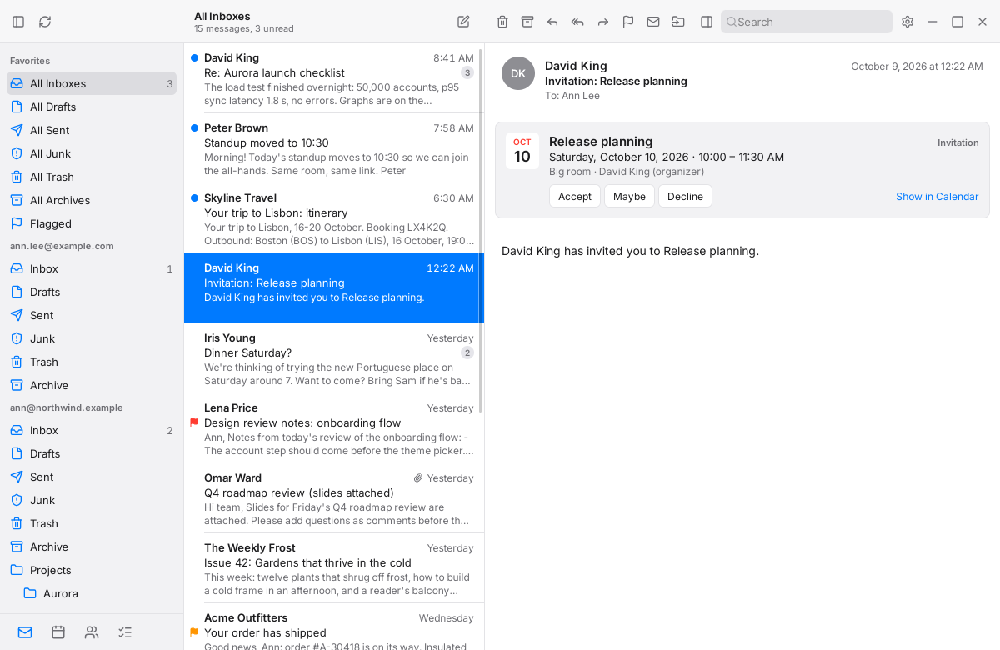
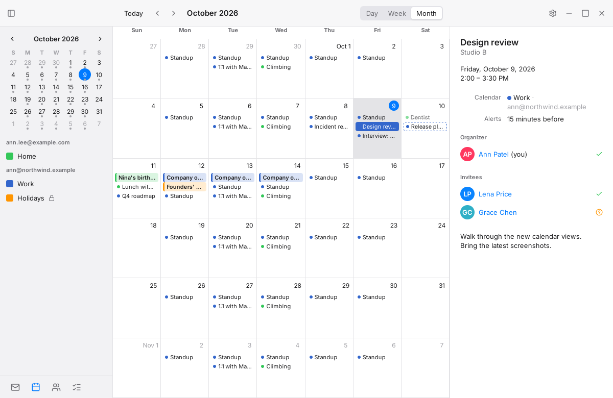

# Frostmail

[](https://github.com/frostyard/frostmail/actions/workflows/ci.yml)

A Linux mail client that works like Apple Mail.app, without looking like a
GNOME or KDE app. Pre-release: it syncs, reads, searches and sends generic
IMAP, Gmail and iCloud accounts, and is in its daily-driver trial
([M4](docs/plans/0006-m4-daily-driver.md)). Contacts, calendars and tasks
over CardDAV, CalDAV and Google Tasks, invitations answered from the reader,
and a To-Do bar beside the inbox are arriving
([M4.5](docs/plans/0007-m4.5-people-calendar-tasks.md)). See the
[roadmap](docs/plans/0002-roadmap.md).


| | |
| --- | --- |
|  |  |
|  |  |
|  |  |
|  |  |
|  |  |

<sub>The screenshots show made-up mail (`app/e2e/showcase`) in the real
app; `make screenshots` retakes them.</sub>

- **maild** is a per-user Go daemon that owns sync, a SQLite cache with
  full-text search, and a JSON-RPC socket.
- **The app** is Tauri v2 with a React UI in the system WebKitGTK.
- **mailctl** is a command-line client of the same socket.

## Develop

Requirements: Go 1.27 and `mise install` (golangci-lint) on the host;
[nsl](https://github.com/frostyard/nsl) for the app toolchain; incus for the
test mail server.

```sh
nsl create frostmail --distro debian:13
nsl run -m frostmail --root bash dev/nsl/provision.sh "$(id -un)"
dev/incus/mailtest.sh up
make check          # host: generated files, vet, lint, unit tests
make engine-it      # integration tests against the test mail server
make ui-test        # nsl: typecheck and UI tests
make app-run        # nsl: maild plus the built app
```

`make help` lists every target. Architecture starts at
[docs/design/overview.md](docs/design/overview.md); agents start at
[AGENTS.md](AGENTS.md).

## License

MIT. `third_party/go-imap` is MIT, from emersion/go-imap, with the patches in
its `FROSTMAIL-PATCHES.md`.
